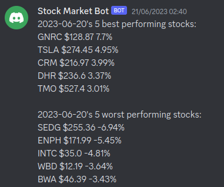
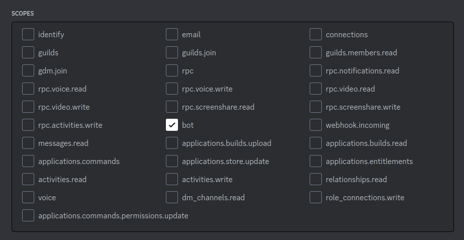
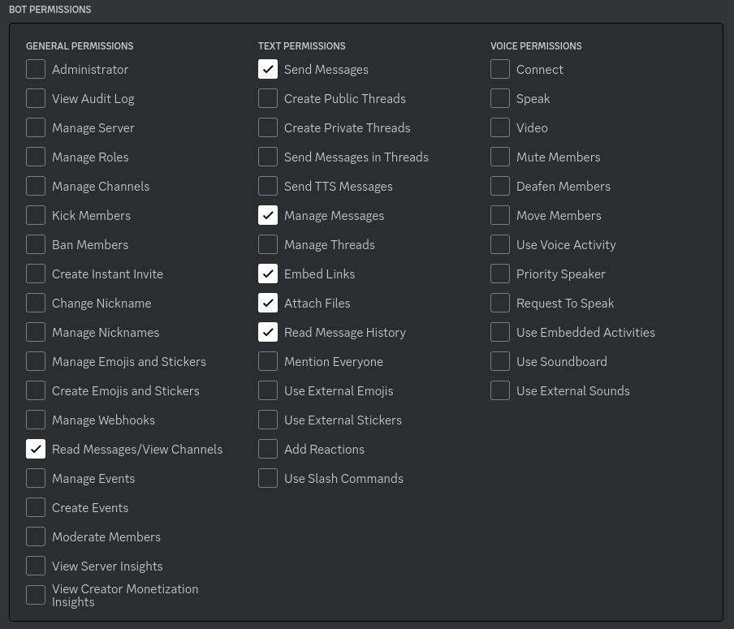

# stock-watcher-discord

## Description

This application consists in creating a bot user on discord to display stock market data. 

It uses `discord.py`, a Python wrapper for the Discord API to deal with the Discord integration.

To fetch market data, `yfinance` (an open-source tool that uses Yahoo's publicly available APIs) is used.

Every day that the market opens, there is a scheduled message at a specific time that indicates the top and bottom performing stocks from the previous working day. 

Example (message from June 21st 2023):



The application informs the users when the market doesn't open (weekend and/or holidays).

The list of S&P500 tickers and the days that the market is closed are retrieved from certain webpages through the pandas module. 

Numpy is used on the scheduled message's stock selection. 


## Future functionalities

1. A database to store each user's watchlist (username, array of stocks, etc...)

2. Add admin user functionalities. 

3. Discord command messages such as:

    1. `$help`

        Displays all commands available.

    2. `$add [TICKER]`

        Adds ticker to user watchlist.

    3. `$remove [TICKER]`

        Removes ticker from user watchlist.

    4. `$watchlist`

        Shows user's watchlist.

    5. `$watchlist [USERNAME]`

        Shows watchlist of a specific user.

    6. `$show [NUMBER_OF_RESULTS]`

        Configures the number of results showned on the scheduled messages (requires extra privileges).

    7. `$schedule [HOURS] [MINUTES]`

        Configures the time that the scheduled messages are displayed (requires extra privileges).

    8. `$message`

        Repeats scheduled message.

4. Improve message formatting.

5. Find an alternative to yfinance (its not possible to get after hours stock price from yfinance).


## Setup

1. Create a discord server


2. Go to [discord.com/developers/applications](https://discord.com/developers/applications)

    1. Log in


    2. Click in the "New application" button


    3. Insert Bot name


    4. Go to OAuth2/URL Generator tag in the left side menu

        1. Under "scope" select "bot"

            
        
        2. Under "bot permissions" select "Read Messages/View Channels", "Send Messages", "Manage Messages", "Embed Links", "Attach Files" and "Read Message History".

            

        3. Copy generated URL


    5. Go to generated URL

        1. Select Discord Server to bind bot

        2. Authorize the permissions


    6. Go to "Bot" tag in the left side menu under settings

        1. Slide on Message Content Intent 

        2. Copy bot token (do not share this token!!)

        3. Create a file named "config.py" and write `token = [INSERT TOKEN]`


    7. On Discord app go to User settings/advanced and enable Developer Mode

        1. On Discord server, right-click on desired channel and select Copy Channel ID

        2. On config.py append `channel_id = "[INSERT CHANNEL ID]"`

3. Install following modules:

```
pip3 install discord.py
pip3 install yfinance
pip3 install pandas
pip3 install numpy
```

4. Run application:

```
python3 stock_watcher.py
```


